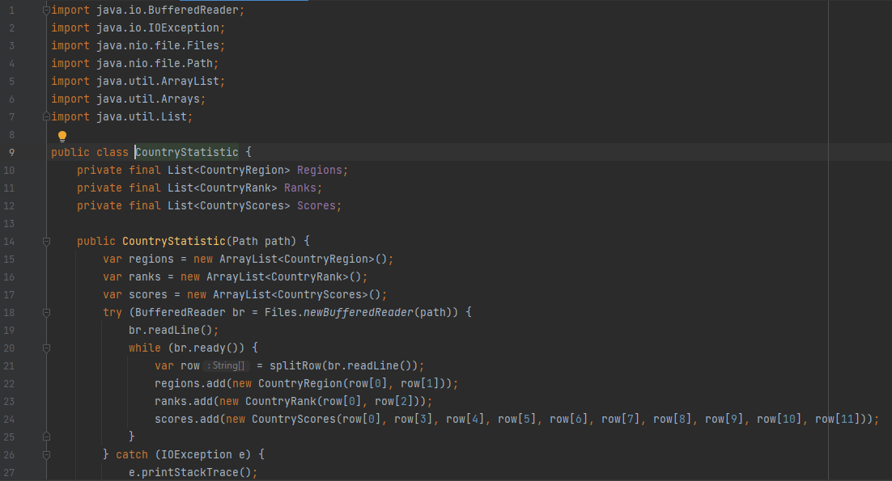
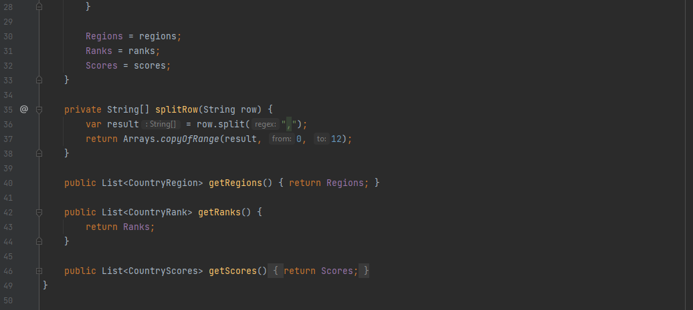
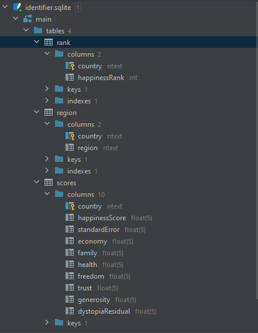
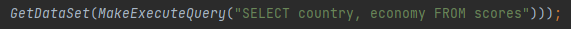
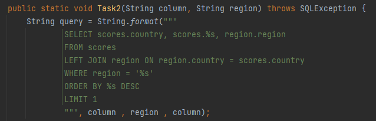
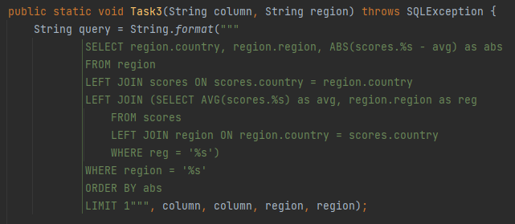
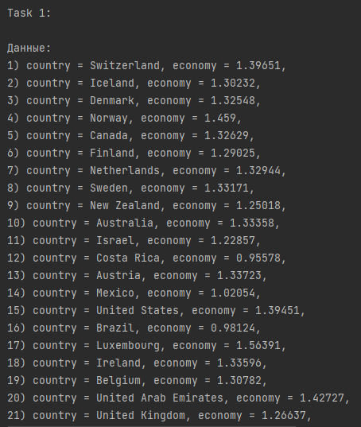
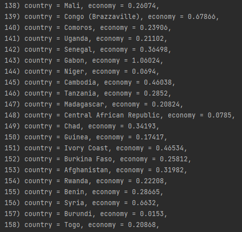
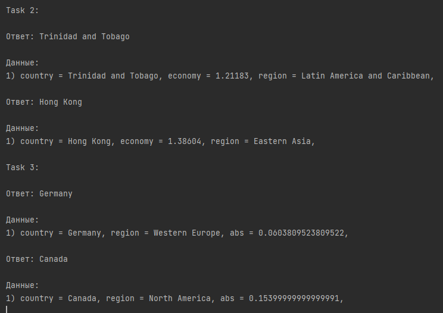
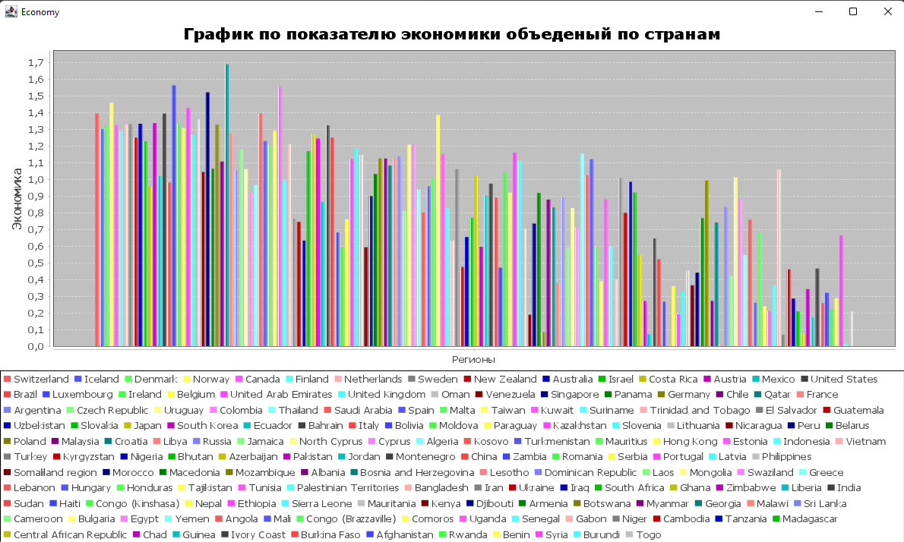

Морозов Андрей Андреевич
1. Вариант 5
2. Создал сущности:
    
    CountryStatistic - хранение информации распаршеного CSV файла, до её сохранения в БД

    CountryRank - элемент таблицы rank (столбцы: название страны, её рейтинг)

    CountryRegion - элемент таблицы region (столбцы: название строки, её регион)

    CountryScores - элемент таблицы scores (столбцы: название страны, разные очки...)

    Parser - основной класс с задачами

Я постарался сделать структуру БД максимально приближенную к нормальной третьей форме.

3. Распарсил CSV фаил и сохранил все данные:

4-5. Создал БД SQLite и заполнил её соответсвующими объектам таблицами:

6. Все данные из набора объектов сохранил в таблицы БД
7. Сделал SQL-запросы в БД, для своих задач:
  
8. Полученные данные вывел в текстовом виде в консоль:
  
9. Числовые данные по заданию визуализировал в виде гистограммы:
